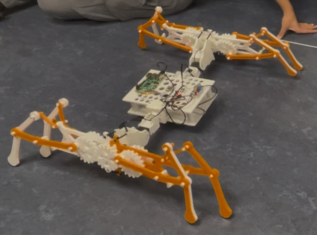

# Crawler_code
Code for the crawler robot (fall 2025 robot studio) including basic walking, simulation in MuJoCo, training and testing ML/RL crabwalking and sim-to-real.

## Setup
`Pi_walking.py` and `Pi_walking_RL.py` need to be run on the robot. The rest are run on your machine. `requirements.txt` has all the required packages listed for both the robot and local machine, use it to set up environments on both.

When cloning this repo on the robot, don't forget to include the submodules (this includes the madgwick filter submodule in `external`). Follow the setup instructions for the filter on that repo's `README`.

## Basic Walking - `Pi_walking.py`
This is the code to allow keyboard controlled walking using the geartrain-powered legs. The keyboard commands are:

w - forward

a - left

s - backwards

d - right

z - spin left

x - spin right

Note that you don't hold down the keys, you press once then hit enter to stop.

Right now it walks forward while keeping the servo legs upright. However, in the balance function to do this was originally designed to use a PID controller to take in filtered IMU data and self-balance the robot automatically. This is still a work in progress and has all been commented out for now. However, the filtered data stream is working on the robot right now so once the PID controller is tuned, it will be pushed to this repo.

## Simulated ML gait training - `gait optimization_test.py`
This class has methods for three different algorithms to train the robot to crabwalk. Random search, hill climber and random parallel mutation hill climber are there, just comment as required to choose which one to try in the main function. These methods assume that the robot is crabwalking sideways using just the servo arms (not the gear driven Klann linkages on the ends) and optimises the parameters around a sin-based gait. This outputs a 4x3 matrix of parameters. These can be plugged into `mesh_demo_test.py` for testing in MuJoCo or copied into `parameters.txt` to store for later use.

## Simulated ML gait testing - `mesh_demo_test.py`
This runs the real-time MuJoCo viewer with the robot model running a sin-based crabwalking gait. To test specific parameters (ie: those found via optimization in `gait_optimization_test.py`) just set `gait_params` equal to your 4x3 matrix. 

## RL training - `ppo_train.py`
This uses `gymnasium` to train the `stable_baselines3` implementation of the PPO algorithm in the MuJoCo environment. The reward function is set to encourage smooth crabwalking without using the Klann linkages (which are imported as single rigid STL files so they can't move). The number of timesteps can easily be changed through the `timesteps` argument of the `train_model` function. 200,000 is relatively quick and dirty, 1 or 2 million is more substancial (>20 minutes training time). The output policy parameters are saved as `ppo_gait_actuator_1.zip`. These are neural network weights, NOT sin parameters.

## RL testing in simulation - `ppo_test.py`
This runs the MuJoCo real-time viewer to show you the trained gait (same idea as `mesh_demo_test.py`). It runs the policy by running a neural network with the weights in `ppo_gait_actuator_1` for each step, feeding in IMU data and servo positions each time to get the next servo positions as output. The simulation is set to run at the same rate as the training and real robot updates.

## RL sim-to-real - `Pi_walking_RL.py`
This effectively does the same thing as `ppo_test` except instead of sending each set of model-output servo positions to the MuJoCo test environment, it sends them to the actual servos on the robot. To do this, the output motor angles have to be converted, translating rad to deg, changing direction where needed, and adding offsets for where the zero position on the actual servo is different to in MuJoCo. Note that for this to work on the robot, the model weights need to be put on the robot as well.

